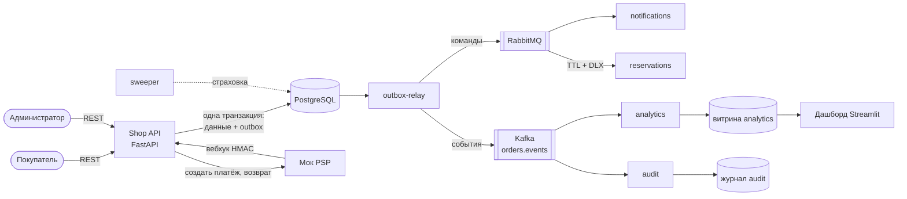

# ShopCore — бэкенд интернет-магазина

Пет-проект системного аналитика: бэкенд интернет-магазина с резервированием товара, асинхронной оплатой через платёжного провайдера и событийной интеграцией (RabbitMQ + Kafka).

Проект показывает то, на чём держится любая система, где двигаются деньги:

- статусная модель и допустимые переходы;
- защита от гонок за последний товар;
- идемпотентность: платёж не проведётся дважды, повтор запроса не создаст второй заказ;
- надёжная асинхронная интеграция с внешней платёжной системой (подписанные вебхуки, дубли, поздние оплаты);
- transactional outbox, команды в RabbitMQ и события в Kafka;
- витрина для аналитики, которая строится из событий.

> Статус: код готов, документация 03–07 в работе.

## Документация

| Документ | Статус |
| --- | --- |
| [01. Vision](docs/01-vision.md) | черновик |
| [02. Требования](docs/02-requirements.md) | черновик |
| 03. Модель данных | — |
| 04. API | — |
| 05. Сценарии и статусы | — |
| 06. Интеграции | — |
| 07. Параллели с iGaming | — |
| [ADR](docs/adr/) | — |

## Архитектура



| Сервис | Что делает |
| --- | --- |
| `api` | REST API: каталог, корзина, заказы, оплата, админка, приём вебхуков |
| `psp-mock` | Фейковый платёжный провайдер: страница оплаты, подписанные вебхуки, ретраи, дубли, возвраты |
| `outbox-relay` | Забирает сообщения из таблицы outbox и публикует: события → Kafka, команды → RabbitMQ |
| `notifications` | Consumer RabbitMQ: «отправляет» письма (пишет в лог и таблицу), 3 повтора → parking-очередь |
| `reservations` | Consumer RabbitMQ: снимает резерв неоплаченного заказа через 15 минут (TTL + dead letter exchange) |
| `sweeper` | Раз в 5 минут ищет просроченные заказы — на случай, если команда из RabbitMQ потерялась |
| `analytics` | Consumer Kafka: строит витрину продаж и воронку заказов в схеме `analytics` |
| `audit` | Consumer Kafka: бессрочный журнал всех событий в схеме `audit` |
| `dashboard` | Дашборд продаж на Streamlit, читает только витрину |

## Быстрый старт

Нужен [Docker Desktop](https://www.docker.com/products/docker-desktop/).

```bash
docker compose up --build
```

Первый запуск скачивает образы и собирает проект — несколько минут. Потом:

| Что | Адрес |
| --- | --- |
| Swagger API | http://localhost:8000/docs |
| Мок платёжки | http://localhost:8001/docs |
| RabbitMQ Management | http://localhost:15672 (guest / guest) |
| Kafka UI | http://localhost:8080 |
| Состояние системы | http://localhost:8000/health |

Тестовые пользователи (создаются автоматически):

| Email | Пароль | Роль |
| --- | --- | --- |
| admin@example.com | Admin12345 | администратор |
| buyer@example.com | Buyer12345 | покупатель |
| buyer2@example.com | Buyer12345 | покупатель |
| fail-buyer@example.com | Buyer12345 | покупатель, письма ему «не доходят» — для демо ретраев |

Все суммы в API — в копейках: `3499000` = 34 990,00 ₽.

## Запуск по модулям

API работает и без брокеров: сообщения копятся в outbox и уйдут, когда брокер появится. Поэтому систему можно поднимать по частям.

| Модуль | Команда | Что посмотреть |
| --- | --- | --- |
| 1. БД, API, каталог | `docker compose up --build api` | Swagger: `GET /products`, `GET /categories`, `/health` |
| 2. Аккаунт и корзина | (тот же API) | `POST /auth/login` → Authorize → `POST /cart/items` |
| 3. Заказы и резервы | (тот же API) | `POST /orders`, `GET /orders/{id}`, `POST /orders/{id}/cancel` |
| 4. Оплата | `docker compose up --build api psp-mock` | `POST /orders/{id}/payments` → открыть `payment_url` → «Оплатить» |
| 5a. RabbitMQ | `docker compose up rabbitmq outbox-relay notifications reservations sweeper` | Очереди в RabbitMQ Management, письма в логах `notifications` |
| 5b. Kafka | `docker compose up kafka kafka-ui analytics audit` | Топик `orders.events` в Kafka UI, consumer groups |
| 6. Дашборд | `docker compose --profile dashboard up --build dashboard` | http://localhost:8501 |

Остановить: `docker compose down`. Удалить все данные и начать с чистого листа: `docker compose down -v`.

## Демо-сценарии

**Покупка целиком.** `POST /auth/login` (buyer) → кнопка Authorize → `POST /cart/items` `{"product_id": 1, "quantity": 2}` → `POST /orders` (заголовок `Idempotency-Key` — любая строка) → `POST /orders/{id}/payments` → открыть `payment_url`, нажать «Оплатить» → `GET /orders/{id}`: статус `paid`, в истории видно, кто и когда менял статус. В логах `notifications` — письмо с чеком, в Kafka UI — события `OrderCreated` и `OrderPaid`.

**Дубль вебхука.** Мок PSP с вероятностью 30% сам присылает уведомление дважды. В логах `psp-mock` видно: первый ответ `paid`, второй `duplicate`. Повторить вручную: `POST /v1/payments/{payment_id}/resend-webhook` в Swagger мока.

**Повтор запроса.** Отправьте `POST /orders` дважды с одним `Idempotency-Key` — вернётся один и тот же заказ.

**Истечение заказа.** Оформите заказ и не платите. Через 15 минут он станет `expired`, резерв снимется, придёт письмо. Для демо поставьте в `.env` `RESERVATION_TTL_SECONDS=60` и перезапустите.

**Ретраи и parking.** Войдите как `fail-buyer@example.com` и оплатите заказ. Письмо трижды не отправится (очереди `notifications.retry.*`) и окажется в `notifications.parking`. Для демо поставьте `NOTIFY_RETRY_DELAYS_SECONDS=5,10,15`.

**Поздняя оплата.** Оформите заказ, создайте платёж, дождитесь `expired` и только потом нажмите «Оплатить». Если товар есть — заказ станет `paid`, если нет — деньги вернутся. Всё видно в `GET /admin/incidents`.

**Гонка за последний товар.** Товар «Смартфон Limited Edition» — в единственном экземпляре. Параллельные заказы: успешен ровно один. Автотест `test_race_for_last_item` запускает 20 одновременных покупок.

**Возврат.** Админ: `POST /admin/orders/{id}/refund` → 202 → через пару секунд PSP подтверждает, заказ `refunded`, товар вернулся на склад.

**Kafka: consumer догоняет.** `docker compose stop analytics`, сделайте несколько покупок, `docker compose start analytics` — он дочитает всё со своего offset. Отставание (lag) видно в Kafka UI → Consumers.

**Kafka или RabbitMQ лежит.** `docker compose stop kafka` — заказы продолжают оформляться, события копятся в `outbox_events`. `docker compose start kafka` — relay всё дошлёт.

## Тесты

```bash
docker compose --profile test run --rm --build tests
```

51 тест на настоящем PostgreSQL: регистрация и вход, каталог, корзина, оформление заказа, гонка 20 покупателей, идемпотентность, все ветки вебхука (успех, дубль, неверная подпись, расхождение суммы, поздняя оплата), возвраты, outbox relay, дедупликация в consumer. Тесты и линтер прогоняются в GitHub Actions на каждый push.

## Структура

```
app/
  api/          # роутеры FastAPI: что принимает и отдаёт каждый эндпоинт
  services/     # бизнес-логика: заказы, оплата, статусы, идемпотентность, outbox
  models/       # таблицы БД (SQLAlchemy)
  schemas/      # форматы запросов и ответов (Pydantic)
  core/         # настройки, БД, JWT, ошибки, логи
workers/        # outbox relay и consumer'ы RabbitMQ и Kafka
psp_mock/       # фейковый платёжный провайдер
migrations/     # миграции схемы БД (Alembic)
dashboard/      # дашборд на Streamlit
scripts/seed.py # тестовые данные
tests/          # автотесты
docs/           # документация системного аналитика
```

## Стек

Python 3.12, FastAPI, PostgreSQL 16, SQLAlchemy 2 + Alembic, RabbitMQ 3.13, Kafka 3.9 (KRaft), Docker Compose, pytest, Streamlit, GitHub Actions.
