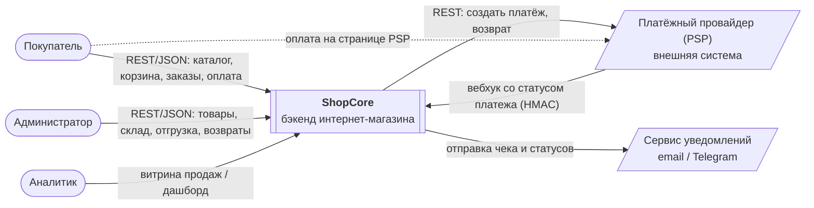

# 01. Vision: ShopCore

> Бэкенд интернет-магазина с асинхронной оплатой, резервированием товара и событийной интеграцией.
> Статус: черновик v0.2 · Автор: Дарья Корепанова

## 1. О документе

Документ фиксирует, **зачем** создаётся система, **для кого**, **что входит** в её границы и **что не входит**. Это точка входа для разработки, тестирования и всех следующих документов в `docs/`. Детальные требования описаны в `02-requirements.md`.

Проект учебный, но документ написан так, как если бы система делалась для реального бизнеса.

## 2. Контекст и проблема

Вымышленный магазин электроники «Вольт» продаёт товары онлайн. Текущая система (условный AS-IS) не справляется:

- **Продажи сверх остатка.** Два покупателя одновременно оформляют последний товар, и оба заказа проходят. Потом одному приходится отказывать и возвращать деньги.
- **Двойные зачисления.** Платёжный провайдер повторно присылает уведомление об оплате, и заказ обрабатывается дважды.
- **«Зависшие» заказы.** Неоплаченные заказы бесконечно держат товар, и его нельзя продать.
- **Нет аналитики.** Данные о продажах выгружаются вручную из рабочей БД, отчёты запаздывают на дни.

## 3. Цели и метрики успеха

| # | Цель | Метрика | Целевое значение |
| --- | --- | --- | --- |
| G1 | Не продавать больше, чем есть на складе | заказы, оформленные сверх доступного остатка | 0 |
| G2 | Не проводить оплату дважды | платежи, проведённые повторно по одному уведомлению PSP | 0 |
| G3 | Возвращать товар в продажу, если заказ не оплачен | время от оформления до снятия резерва | ≤ 15 мин + 1 мин |
| G4 | Быстро подтверждать оплату | время от вебхука PSP до статуса `paid` | ≤ 5 с (p95) |
| G5 | Своевременно уведомлять покупателя | время от оплаты до отправки чека | ≤ 1 мин (p95) |
| G6 | Дать бизнесу аналитику продаж без нагрузки на рабочую БД | задержка данных в витрине продаж | ≤ 1 мин |

## 4. Стейкхолдеры и роли

| Роль | Тип | Что делает в системе | Интерес |
| --- | --- | --- | --- |
| Покупатель | пользователь | регистрируется, выбирает товары, оформляет и оплачивает заказ, отменяет неоплаченный | купить быстро и без ошибок |
| Администратор магазина | пользователь | ведёт каталог и склад, отгружает заказы, оформляет возвраты | актуальный каталог, контроль заказов |
| Аналитик / владелец бизнеса | пользователь | смотрит витрину продаж (опционально — дашборд) | понимать продажи без ручных выгрузок |
| Платёжный провайдер (PSP) | внешняя система | принимает оплату, сообщает результат вебхуком, делает возвраты | корректная интеграция по его контракту |
| Сервис уведомлений (email / Telegram) | внешняя система | доставляет письма и сообщения покупателю | — |
| Команда разработки и QA | внутренние | реализуют и тестируют систему | однозначные требования |

## 5. Границы системы

### В скоупе

- Регистрация, вход, роли `customer` и `admin` (JWT).
- Каталог: категории, товары, фильтры, поиск, пагинация.
- Корзина.
- Оформление заказа с резервированием товара на 15 минут.
- Оплата через внешний PSP с подтверждением по вебхуку.
- Статусная модель заказа и история переходов.
- Отмена неоплаченного заказа покупателем, автоматическое истечение неоплаченного заказа.
- Отгрузка, доставка, полный возврат (действия администратора).
- Уведомления покупателю через очередь задач (RabbitMQ).
- Публикация доменных событий заказа (Kafka) и витрина продаж для аналитики.
- Опционально: дашборд продаж на Streamlit.

### Вне скоупа

- Фронтенд (взаимодействие через REST API, Swagger, Postman). Вайрфреймы ключевых экранов даны только как иллюстрация.
- Доставка и логистика: расчёт стоимости, службы доставки, трекинг.
- Скидки, промокоды, программа лояльности.
- Частичные возвраты, частичная оплата, оплата несколькими платежами.
- Мультивалютность: только RUB.
- Отзывы, рейтинги, рекомендации.
- Реальный PSP: используется мок с тем же поведением (задержки, отказы, повторные вебхуки).

## 6. Контекстная диаграмма (C4, уровень 1)

Внутреннее устройство (API, PostgreSQL, RabbitMQ, Kafka, воркеры) раскрывается на уровне контейнеров в `05-flows.md` и `06-integrations.md`.

## 7. Ключевые сценарии

| ID | Сценарий | Актор | Приоритет |
| --- | --- | --- | --- |
| UC-01 | Регистрация и вход | Покупатель, Администратор | Must |
| UC-02 | Просмотр и поиск по каталогу | Покупатель | Must |
| UC-03 | Управление корзиной | Покупатель | Must |
| UC-04 | Оформление заказа с резервированием | Покупатель | Must |
| UC-05 | Оплата заказа через PSP | Покупатель, PSP | Must |
| UC-06 | Отмена неоплаченного заказа | Покупатель | Must |
| UC-07 | Истечение неоплаченного заказа | Система | Must |
| UC-08 | Управление товарами и складом | Администратор | Must |
| UC-09 | Отгрузка и доставка заказа | Администратор | Should |
| UC-10 | Полный возврат оплаченного заказа | Администратор, PSP | Should |
| UC-11 | Уведомления покупателю | Система | Should |
| UC-12 | Витрина продаж для аналитики | Система, Аналитик | Should |
| UC-13 | Дашборд продаж | Аналитик | Could |

Приоритеты по MoSCoW: Must — без этого релиза нет, Should — нужно, но можно сдвинуть, Could — по возможности.

## 8. Ключевые бизнес-правила

| ID | Правило |
| --- | --- |
| BR-01 | При оформлении заказа товар резервируется на 15 минут. Без оплаты за это время заказ переходит в `expired`, резерв снимается. |
| BR-02 | Цена товара фиксируется в заказе в момент оформления и дальше не меняется. |
| BR-03 | Заказ оплачивается одним платежом на полную сумму. |
| BR-04 | Покупатель может отменить заказ только в статусе `created`. Оплаченный заказ отменяется только возвратом, который оформляет администратор. |
| BR-05 | Возврат — только полный. |
| BR-06 | У заказа может быть не больше одного активного платежа. |
| BR-07 | Снятый с продажи товар (`is_active = false`) нельзя добавить в корзину, но уже оформленные заказы с ним не меняются. |
| BR-08 | Количество одного товара в корзине — от 1 до 10. |
| BR-09 | Деньги хранятся и передаются в копейках (целое число), валюта — RUB. |
| BR-10 | Если оплата пришла после истечения заказа: при наличии товара заказ восстанавливается и считается оплаченным, иначе инициируется автоматический возврат. |
| BR-11 | При истечении заказа покупатель получает уведомление об отмене. |

## 9. Допущения и ограничения

**Допущение (A)** — то, что мы считаем верным, но не контролируем. Если оно окажется неверным, решения придётся пересматривать.

**Ограничение (C)** — условие, заданное заранее, которое мы не выбираем.

- **A1.** PSP гарантирует доставку вебхука хотя бы один раз (at-least-once) и может присылать его повторно.
- **A2.** PSP подписывает вебхуки HMAC-SHA256 общим секретом.
- **A3.** Нагрузка учебная: до 50 RPS на API, до 10 000 товаров, до 1 000 заказов в день.
- **A4.** Один склад, без распределения остатков по точкам.
- **C1.** Стек: Python / FastAPI, PostgreSQL, RabbitMQ, Kafka, Docker Compose.
- **C2.** Вся система запускается локально одной командой `docker compose up`.
- **C3.** События в Kafka хранятся 7 дней; долговременная история — в журнале audit.

## 10. Глоссарий

| Термин | Значение |
| --- | --- |
| Резерв | Количество товара, закреплённое за неоплаченными заказами и недоступное другим покупателям. |
| Доступный остаток | `quantity − reserved`: сколько товара можно заказать прямо сейчас. |
| PSP | Payment Service Provider, внешний платёжный провайдер. |
| Вебхук | HTTP-запрос от внешней системы к нашей с уведомлением о событии. |
| Идемпотентность | Свойство операции: повторный вызов с теми же данными не меняет результат. |
| Outbox | Таблица, куда событие пишется в одной транзакции с данными, а затем отдельным процессом публикуется в брокер. |
| Команда / событие | Команда — просьба «сделай» (одному исполнителю, RabbitMQ). Событие — факт «произошло» (любому числу читателей, Kafka). |
| Витрина | Денормализованная таблица для аналитики, собранная из событий. |
| Брокер сообщений | Программа-посредник между сервисами: один сервис кладёт сообщение, другой забирает, когда готов. Сервисы не вызывают друг друга напрямую и не зависят от того, работает ли получатель прямо сейчас. У нас два брокера: RabbitMQ (команды) и Kafka (события). |
| Дубль вебхука | Повторная доставка того же уведомления PSP с тем же `provider_payment_id`, например если наш ответ 200 потерялся в сети. Это не вторая оплата: деньги списаны один раз. Обрабатываем уведомление один раз, на повтор отвечаем 200 и ничего не меняем. |

### Статусы заказа

| Статус | Значение | Куда может перейти |
| --- | --- | --- |
| `created` | Заказ оформлен, товар зарезервирован, ждём оплату (до 15 минут). | `paid`, `cancelled`, `expired` |
| `paid` | Оплата подтверждена, товар списан со склада. | `shipped`, `refunded` |
| `shipped` | Заказ отгружен. | `delivered` |
| `delivered` | Заказ доставлен. Конечный статус. | — |
| `cancelled` | Покупатель отменил заказ до оплаты, резерв снят. Конечный статус. | — |
| `expired` | Заказ не оплачен за 15 минут, резерв снят. | `paid` (только при поздней оплате, BR-10) |
| `refunded` | Деньги возвращены покупателю. Конечный статус. | — |

## 11. Открытые вопросы и решения

- [x] **Нужно ли уведомлять покупателя об истечении заказа?**
  Решение: да. Отправляем письмо «Заказ не оплачен и отменён, товар снова в продаже» через ту же очередь уведомлений. Статус `expired` также виден в API, и фронтенд может показать его пользователю.
- [x] **Кто разбирает сообщения из parking-очереди уведомлений?**
  Решение: сообщения остаются в parking-очереди, по каждому пишется ошибка в лог. Администратор после устранения причины вручную возвращает их в основную очередь через RabbitMQ Management. Автоматическая переотправка — вне скоупа.
- [x] **Сколько хранить события в Kafka?**
  Решение: 7 дней (стандартная настройка). Этого хватает, чтобы консьюмер догнал поток после сбоя. Бессрочная история хранится в журнале консьюмера audit в БД, поэтому держать её в Kafka не нужно.
