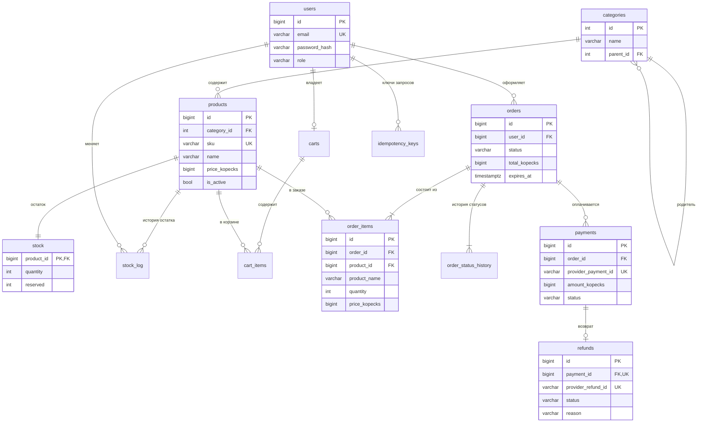

# 03. Модель данных: ShopCore

> Статус: черновик v0.1 · Автор: Дарья Корепанова · Основа: [01-vision.md](01-vision.md), [02-requirements.md](02-requirements.md)

## 1. О документе

Документ описывает, **как хранятся данные** ShopCore в PostgreSQL 16: таблицы, связи, ограничения и индексы, а также **почему** они устроены именно так. Для каждого ограничения указано бизнес-правило (BR) или требование (US, NFR), которое оно защищает.

Схема меняется только миграциями Alembic (`migrations/versions/`, NFR-15). Текущая версия схемы — `0002`.

## 2. Общие соглашения

| Соглашение | Правило | Зачем |
| --- | --- | --- |
| Деньги | целое число копеек, тип `bigint`, суффикс `_kopecks` | без ошибок округления: `0.1 + 0.2 ≠ 0.3` во float (BR-09, NFR-11) |
| Время | `timestamptz`, хранится в UTC | одинаковое время для всех часовых поясов (NFR-11) |
| Идентификаторы | суррогатный `id` (`bigint`/`integer`, автоинкремент) | связи не зависят от бизнес-данных, которые могут меняться |
| Бизнес-идентификаторы | отдельный столбец с `UNIQUE` (`sku`, `provider_payment_id`) | уникальность для людей и внешних систем |
| Удаление | товары и категории не удаляются физически | на них ссылаются заказы (BR-07) |
| История | записи истории и журналов не меняются и не удаляются | аудит (NFR-12) |
| Правила | важные бизнес-правила продублированы ограничениями БД | защита даже при ошибке в коде или правке данных в обход API |

**Имена ограничений и индексов:**

| Префикс | Что это |
| --- | --- |
| `pk_` | первичный ключ (уникальность + не пусто; индекс создаётся автоматически) |
| `uq_` | ограничение уникальности (индекс создаётся автоматически) |
| `ix_` | обычный индекс, только ускоряет поиск |
| `ck_` | проверка условия (`CHECK`) |
| `fk_` | внешний ключ: связанная строка обязана существовать |

Индекс на столбец внешнего ключа PostgreSQL сам не создаёт, поэтому такие индексы добавляются вручную.

## 3. ER-диаграмма

Схема `public` (данные магазина):

Служебные таблицы (`outbox_events`, `processed_messages`, `incidents`, `notifications`) и таблицы консьюмеров Kafka (схемы `analytics` и `audit`) внешними ключами с основными таблицами не связаны и описаны в разделах 4.6–4.7.

## 4. Таблицы

### 4.1. Пользователи

#### `users`

| Столбец | Тип | Обяз. | Описание |
| --- | --- | --- | --- |
| id | bigint | да | PK |
| email | varchar(255) | да | хранится в нижнем регистре, уникален (US-01) |
| password_hash | varchar(255) | да | bcrypt-хеш; пароль в открытом виде не хранится (NFR-08) |
| role | varchar(16) | да | `customer` или `admin` |
| created_at | timestamptz | да | время регистрации |

Ограничения: `uq_users_email`, `ck_users_role` (`role IN ('customer', 'admin')`).

### 4.2. Каталог

#### `categories`

Дерево категорий в одной таблице: каждая категория ссылается на родителя (**список смежности**). Корневые категории — с `parent_id = NULL`. Глубина не ограничена. Фильтр каталога по категории включает все подкатегории — это рекурсивный запрос (recursive CTE) по `parent_id` (US-03).

| Столбец | Тип | Обяз. | Описание |
| --- | --- | --- | --- |
| id | integer | да | PK |
| name | varchar(100) | да | название |
| parent_id | integer | нет | FK → `categories.id`; пусто у корневых |

Индексы: `ix_categories_parent_id` — поиск подкатегорий и проверка при удалении родителя (миграция 0002).

#### `products`

| Столбец | Тип | Обяз. | Описание |
| --- | --- | --- | --- |
| id | bigint | да | PK |
| category_id | integer | да | FK → `categories.id` |
| sku | varchar(64) | да | артикул, уникален (US-15) |
| name | varchar(200) | да | название |
| description | text | да | описание, может быть пустой строкой |
| price_kopecks | bigint | да | текущая цена; `> 0` |
| is_active | boolean | да | `false` — снят с продажи (мягкое удаление, BR-07) |
| created_at, updated_at | timestamptz | да | |

| Объект | Назначение |
| --- | --- |
| `uq_products_sku` | один артикул — один товар (`SKU_TAKEN`) |
| `ck_products_price_positive` | цена больше нуля |
| `ix_products_category_id` | фильтр по категории; проверка при удалении категории |
| `ix_products_active_created` (is_active, created_at) | главный запрос каталога: «активные, сначала новые» |

#### `stock`

Остаток товара. **Доступно к покупке = `quantity − reserved`.**

| Столбец | Тип | Обяз. | Описание |
| --- | --- | --- | --- |
| product_id | bigint | да | PK и FK → `products.id` (связь один к одному) |
| quantity | integer | да | сколько физически на складе |
| reserved | integer | да | сколько обещано неоплаченным заказам |
| updated_at | timestamptz | да | |

Ограничения: `quantity >= 0`, `reserved >= 0`, **`reserved <= quantity`** — база не даст зарезервировать больше, чем есть, даже при ошибке в коде (G1).

Как меняются числа (пример: на складе 25):

| Событие | quantity | reserved | Доступно |
| --- | --- | --- | --- |
| исходно | 25 | 0 | 25 |
| заказ на 1 шт. оформлен | 25 | 1 | 24 |
| заказ оплачен | 24 | 0 | 24 |
| *или* заказ истёк / отменён | 25 | 0 | 25 |
| *или* возврат оплаченного заказа | +1 | 0 | +1 |

Строки склада блокируются на время транзакции (`SELECT … FOR UPDATE`) в порядке `product_id` — так две параллельные покупки последнего товара не пройдут обе, и не возникнет взаимной блокировки (deadlock).

#### `stock_log`

Журнал ручных изменений остатка администратором (US-16): `product_id` (FK), `changed_by` (FK → `users.id`), `old_quantity`, `new_quantity`, `created_at`. Индекс `ix_stock_log_product_id`.

### 4.3. Корзина

#### `carts` и `cart_items`

| Таблица | Столбцы | Ограничения |
| --- | --- | --- |
| carts | id, user_id, created_at, updated_at | `uq_carts_user_id` — одна корзина на пользователя |
| cart_items | cart_id, product_id, quantity, created_at | PK (cart_id, product_id) — товар в корзине один раз; `quantity BETWEEN 1 AND 10` (BR-08) |

Корзина хранит **ссылку** на товар без цены: цена в корзине всегда текущая. При оформлении заказа корзина удаляется целиком (US-07, AC 6). Резерва корзина не создаёт.

### 4.4. Заказы

#### `orders`

| Столбец | Тип | Обяз. | Описание |
| --- | --- | --- | --- |
| id | bigint | да | PK, номер заказа |
| user_id | bigint | да | FK → `users.id` |
| status | varchar(16) | да | текущий статус, см. статусную модель в vision |
| total_kopecks | bigint | да | сумма заказа, `> 0` |
| expires_at | timestamptz | да | срок оплаты: оформление + 15 минут (BR-01) |
| created_at, updated_at | timestamptz | да | |

| Объект | Назначение |
| --- | --- |
| `ck_orders_status` | только 7 допустимых статусов |
| `ix_orders_user_created` (user_id, created_at) | «мои заказы, сначала новые» (US-08) |
| `ix_orders_status_expires` (status, expires_at) | поиск просроченных неоплаченных заказов воркером sweeper (US-13) |

Допустимость **переходов** между статусами проверяется в коде (`app/services/statuses.py`), а не ограничением БД: `CHECK` видит только новое значение и не знает, каким было старое.

#### `order_items`

| Столбец | Тип | Описание |
| --- | --- | --- |
| id | bigint | PK |
| order_id | bigint | FK → `orders.id` |
| product_id | bigint | FK → `products.id` |
| product_name | varchar(200) | **копия** названия на момент заказа |
| quantity | integer | `> 0` |
| price_kopecks | bigint | **копия** цены на момент заказа, `> 0` |

Название и цена копируются намеренно — это осознанная **денормализация** (BR-02): если завтра товар подорожает или переименуется, старые заказы и чеки не изменятся. `UNIQUE (order_id, product_id)` — товар в заказе одной строкой.

#### `order_status_history`

Журнал всех переходов статуса: `order_id` (FK), `from_status` (пусто у первой записи), `to_status`, `actor` (`customer` / `admin` / `system` / `psp`), `reason`, `created_at`. Индекс `ix_order_status_history_order_id`.

`orders.status` отвечает на вопрос «что сейчас», история — «кто, когда и почему». Записи не меняются и не удаляются (NFR-12). Нужна для разбора споров, аудита и аналитики (время от оформления до оплаты).

### 4.5. Оплата

#### `payments`

| Столбец | Тип | Описание |
| --- | --- | --- |
| id | bigint | PK, наш номер платежа |
| order_id | bigint | FK → `orders.id` |
| provider_payment_id | varchar(64) | номер платежа в PSP, **уникален** |
| amount_kopecks | bigint | сумма, `> 0` |
| status | varchar(20) | `pending`, `succeeded`, `failed`, `amount_mismatch`, `refund_pending`, `refunded` |
| payment_url | text | ссылка на страницу оплаты PSP |
| created_at, updated_at | timestamptz | |

| Объект | Назначение |
| --- | --- |
| `uq_payments_provider_payment_id` | один платёж PSP — одна строка; основа защиты от дублей вебхука (US-11) |
| `uq_payments_one_pending_per_order` — уникальный **частичный** индекс по `order_id` `WHERE status = 'pending'` | у заказа не больше одного активного платежа (BR-06); неуспешных может быть сколько угодно |
| `ix_payments_order_id` | платежи заказа |

#### `refunds`

Возврат только полный (BR-05), поэтому `UNIQUE (payment_id)` — не больше одного возврата на платёж. Столбцы: `provider_refund_id` (уникален, номер в PSP), `amount_kopecks`, `status` (`pending`, `succeeded`, `failed`, `request_failed`), `reason` (`admin`, `late_payment`, `cancelled_order`, `duplicate_payment`), `last_error`.

### 4.6. Служебные таблицы надёжности

| Таблица | Назначение | Ключевые ограничения |
| --- | --- | --- |
| `idempotency_keys` | сохранённый ответ на запрос с `Idempotency-Key`: повтор получает тот же ответ (US-07, US-10) | `UNIQUE (user_id, endpoint, key)`; хеш тела запроса для проверки «тот же ли запрос» |
| `outbox_events` | сообщения для брокеров, записанные в одной транзакции с данными; воркер outbox-relay отправляет их и ставит `sent_at` | `UNIQUE (message_id)`; `destination IN ('kafka', 'rabbitmq')`; частичный индекс `ix_outbox_unsent` по неотправленным |
| `processed_messages` | какие сообщения консьюмер уже обработал — защита от дублей | PK (consumer, message_id) |
| `incidents` | журнал ситуаций для ручного разбора: расхождение суммы, неизвестный платёж, поздняя оплата | индекс по `kind` |
| `notifications` | «отправленные» письма (в учебной версии письмо сохраняется, а не уходит наружу) | `UNIQUE (command_id)` — одна команда не даст двух писем |

Ключ идемпотентности записывается в той же транзакции, что и операция. Если операция завершилась ошибкой, откатывается и ключ — повторить запрос с тем же ключом можно.

### 4.7. Данные консьюмеров Kafka

Живут в отдельных схемах. Магазин в них не пишет, пишут только консьюмеры Kafka; аналитики не ходят в рабочие таблицы.

| Таблица | Кто пишет | Содержимое |
| --- | --- | --- |
| `analytics.sales_daily` | analytics | по дням и товарам: оплаченные заказы, штуки, выручка; возвраты вычитаются. PK (day, product_id) |
| `analytics.orders_daily` | analytics | воронка по дням: оформлено, оплачено, истекло, отменено, возвращено. PK (day) |
| `analytics.processed_events` | analytics | обработанные `event_id`: дубль события не исказит витрину |
| `audit.event_log` | audit | все события заказов бессрочно; PK по `event_id` — дубль не вставится |

## 5. Как данные меняются в ключевых операциях

Каждая операция — одна транзакция: либо всё, либо ничего.

| Операция | Что меняется |
| --- | --- |
| Оформление заказа (US-07) | блокировка корзины и строк `stock` → `orders`, `order_items` → `stock.reserved += qty` → история `created` → удаление корзины → outbox: `OrderCreated` (Kafka), `ExpireReservation` (RabbitMQ, отложенная) → ключ идемпотентности |
| Успешная оплата (US-11) | `payments.status = succeeded` → `orders.status = paid` → `stock.quantity −= qty`, `stock.reserved −= qty` → история → outbox: `OrderPaid`, `SendNotification` |
| Истечение заказа (US-13) | `orders.status = expired` → `stock.reserved −= qty` → история → outbox: `OrderExpired`, `SendNotification` |
| Отмена покупателем (US-09) | `orders.status = cancelled` → `stock.reserved −= qty` → история → outbox: `OrderCancelled` |
| Подтверждённый возврат (US-18) | `refunds.status = succeeded`, `payments.status = refunded` → `orders.status = refunded` → `stock.quantity += qty` → outbox: `OrderRefunded`, `SendNotification` |

## 6. Известные ограничения и улучшения

| # | Что | Почему важно | Возможное решение |
| --- | --- | --- | --- |
| 1 | `outbox_events`, `idempotency_keys`, `processed_messages` растут бесконечно | со временем замедлят запросы и займут место | регулярная чистка: отправленные сообщения и ключи старше 7 дней |
| 2 | Нет индекса на `cart_items.product_id`, `order_items.product_id` | медленная проверка при снятии товара с продажи и отчёты «в каких заказах товар» на больших объёмах | добавить индексы миграцией |
| 3 | Истёкший заказ не возвращает товары в корзину | покупателю придётся собирать корзину заново | **открытый вопрос к бизнесу** |
| 4 | Допустимость переходов статусов проверяется только в коде | при прямой правке данных в обход API переход не проверяется | триггер в БД или доступ к данным только через API |
| 5 | Счётчик неудачных входов хранится в памяти процесса API | при нескольких экземплярах API лимит считается отдельно в каждом | хранить счётчик в Redis |
| 6 | Остаток хранится одним числом на товар | нет поддержки нескольких складов (допущение A4) | таблица остатков по складам |

## 7. Открытые вопросы

- [ ] Возвращать ли товары в корзину, если заказ истёк или отменён?
- [ ] Сколько хранить служебные записи (outbox, ключи идемпотентности): 7 дней достаточно?
