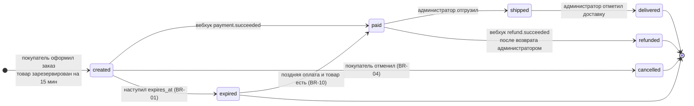
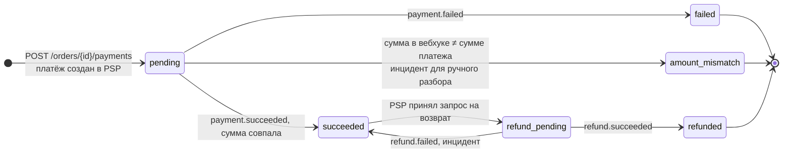
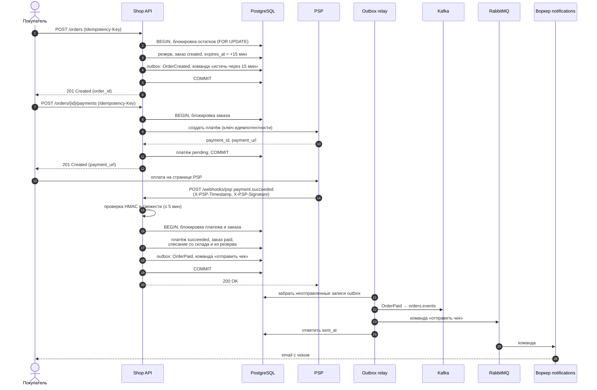
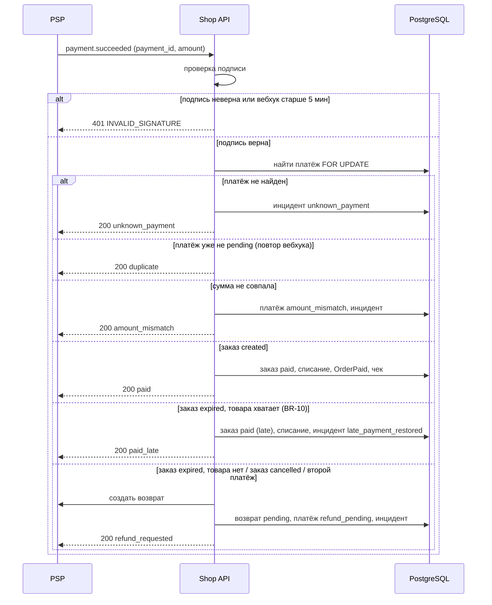
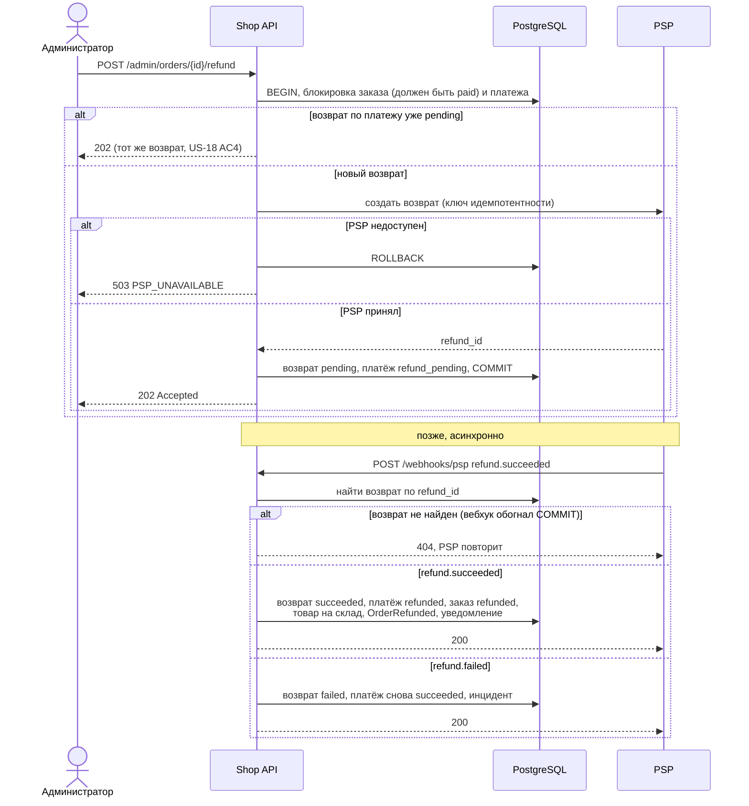
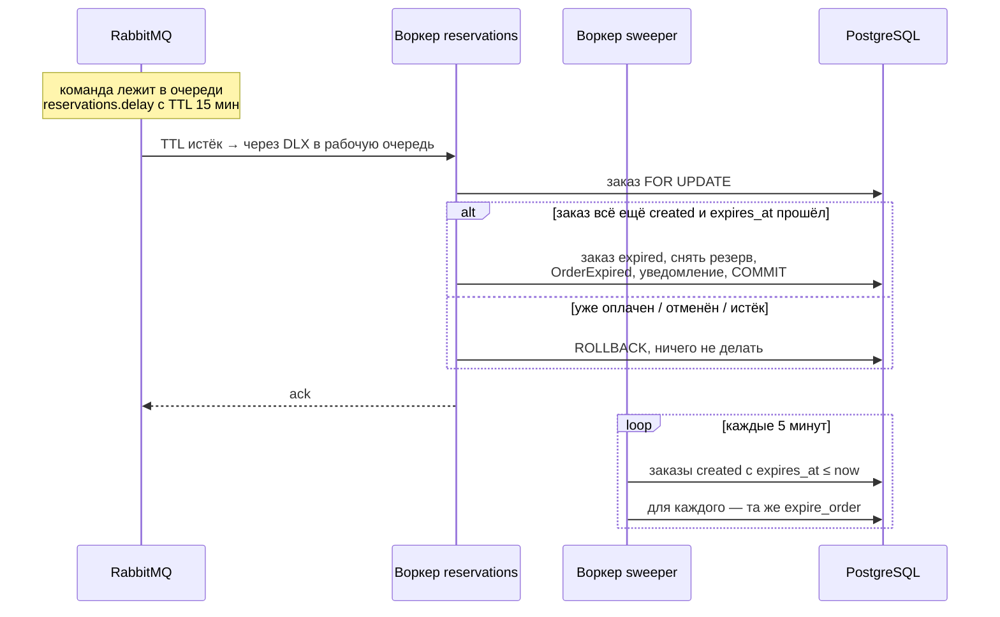
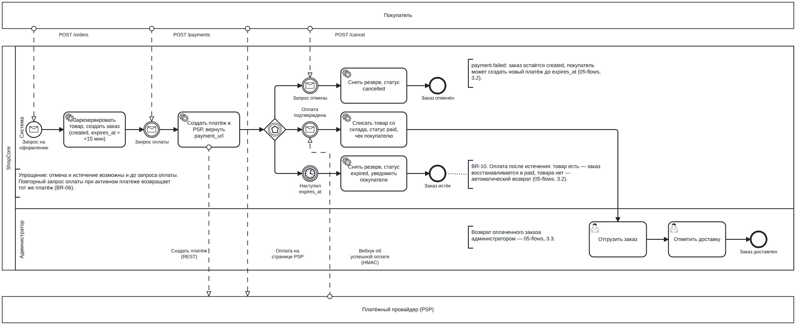

# 05. Процессы и потоки: ShopCore

> Статус: черновик v0.1 · Автор: Дарья Корепанова · Основа: [01-vision.md](01-vision.md) v0.2, [02-requirements.md](02-requirements.md) v0.2, код `app/services/` (сверено 2026-10-10)

## 1. О документе

Документ показывает, как заказ и деньги движутся через систему: какие бывают статусы, кто и по какому событию их меняет, в каком порядке участники обмениваются сообщениями.

| Раздел | Нотация | Что отвечает |
|---|---|---|
| 2 | UML state machine | Какие статусы есть у заказа и платежа и какие переходы разрешены |
| 3 | UML sequence | Кто кого вызывает и в каком порядке: API, БД, PSP, брокеры, воркеры |
| 4 | BPMN 2.0 | Бизнес-процесс «от заказа до доставки» с участниками и событиями |

Диаграммы разделов 2–3 написаны в Mermaid и отображаются прямо на GitHub. BPMN-схема лежит отдельным файлом [bpmn/order-to-delivery.bpmn](bpmn/order-to-delivery.bpmn). Его можно открыть в [bpmn.io](https://demo.bpmn.io) (перетащить файл в окно) или в Camunda Modeler; рядом лежит картинка [bpmn/order-to-delivery.png](bpmn/order-to-delivery.png).

## 2. Статусные модели

### 2.1. Заказ

Разрешённые переходы заданы в коде одной таблицей (`app/services/statuses.py`). Любой переход пишется в `order_status_history` с актором и причиной (NFR-12). Попытка недопустимого перехода → `409 INVALID_TRANSITION`.

| Переход | Кто инициирует (`actor`) | Триггер | Что ещё происходит в той же транзакции |
|---|---|---|---|
| → `created` | customer | `POST /orders` | Резерв товара, событие `OrderCreated`, команда на истечение через 15 мин |
| `created` → `paid` | psp | Вебхук `payment.succeeded` | Товар списывается со склада и из резерва, `OrderPaid`, чек покупателю |
| `created` → `cancelled` | customer | `POST /orders/{id}/cancel` | Резерв снимается, `OrderCancelled` |
| `created` → `expired` | system | Воркер `reservations` (TTL в RabbitMQ) или `sweeper` (страховка, раз в 5 мин) | Резерв снимается, `OrderExpired`, уведомление (BR-11) |
| `expired` → `paid` | psp | Вебхук `payment.succeeded` после истечения, товара хватает | Товар списывается (резерва уже нет), `OrderPaid` с `late: true`, инцидент `late_payment_restored` |
| `paid` → `shipped` | admin | `POST /admin/orders/{id}/ship` | `OrderShipped`, уведомление |
| `shipped` → `delivered` | admin | `POST /admin/orders/{id}/deliver` | `OrderDelivered` |
| `paid` → `refunded` | psp | Вебхук `refund.succeeded` по возврату, который запросил администратор | Товар возвращается на склад, `OrderRefunded`, уведомление |

Важно: возврат запрашивается в статусе `paid`, но заказ становится `refunded` только по вебхуку, когда PSP подтвердил, что деньги ушли. Между этими моментами заказ остаётся `paid`.

Чего в модели нет (и это осознанно или вопрос бизнесу):

- возврата отгруженного заказа (`shipped` / `delivered` → `refunded`) — возвраты после отгрузки вне MVP;
- отмены оплаченного заказа покупателем — только возврат через администратора (BR-04);
- `cancelled` → `paid`: оплата отменённого заказа всегда уходит в автоматический возврат, статус заказа не меняется.

### 2.2. Платёж

У платежа своя статусная модель (`payments.status`). Она не совпадает со статусами заказа: например, `payment.failed` переводит в `failed` платёж, а заказ остаётся `created`.

Правила, которые следуют из модели:

- Повторный вебхук по платежу в любом статусе, кроме `pending`, ничего не меняет и получает `200 duplicate` (US-11 AC4).
- Пока есть платёж в `pending`, новый не создаётся: `POST /payments` возвращает существующий (BR-06). После `failed` можно создать новый.
- `succeeded` у платежа не значит `paid` у заказа: если заказ уже отменён или это второй платёж, деньги сразу возвращаются (раздел 3.2).

## 3. Последовательности

### 3.1. Оформление и оплата (основной сценарий)

Ключевые решения на диаграмме:

- **Шаги 2–5 и 17–20 — одна транзакция.** Событие пишется в таблицу `outbox_events` вместе с изменением заказа, а в брокеры его отправляет отдельный процесс (relay). Поэтому не бывает «заказ оплачен, а событие потерялось» и наоборот.
- **Ответ PSP (шаг 21) отправляется после COMMIT.** Если API упал раньше, PSP не получил 200 и повторит вебхук (до 5 попыток с паузами 1, 2, 4, 8 с), а повтор безопасен благодаря проверке статуса платежа.
- **Вызов PSP внутри транзакции (шаги 9–10)** — осознанное упрощение: строка заказа заблокирована до ответа PSP. Для создания платежа это терпимо, для возврата — нет (findings #14, раздел 3.3).

### 3.2. Обработка вебхука `payment.succeeded`: все ветки

Один и тот же вебхук приводит к разным результатам в зависимости от состояния платежа и заказа. Все ветки отвечают PSP `200`, чтобы он не повторял доставку бесконечно (кроме неверной подписи — `401`).

`payment.failed` проходит те же проверки (подпись, поиск платежа, дубль, сумма), затем платёж → `failed`, заказ остаётся `created`, покупатель может попробовать снова до `expires_at` (US-11 AC5).

### 3.3. Возврат администратором

Риски этого потока, найденные при разборе (подробно — в журнале находок):

| # | Проблема | Что предлагается |
|---|---|---|
| 13 | Ключ идемпотентности возврата содержит случайный uuid4: повтор запроса может создать второй возврат в PSP | Детерминированный ключ `refund-{payment_id}` |
| 14 | Вызов PSP внутри транзакции: если после ответа PSP транзакция откатится, деньги ушли, а записи о возврате нет; вебхук по нему получает 404, пока PSP не исчерпает 5 попыток | Сначала записать возврат в статусе `requested` и команду в outbox, вызывать PSP из отдельного воркера |
| 16 | При `PSP_UNAVAILABLE` инцидент `refund_request_failed` откатывается вместе с транзакцией | Писать инцидент в отдельной транзакции |

### 3.4. Истечение заказа

Два независимых механизма, оба вызывают одну и ту же идемпотентную функцию `expire_order`: первый срабатывает точно в срок, второй страхует, если первый потерял сообщение.

## 4. BPMN: от заказа до доставки

Файл: [bpmn/order-to-delivery.bpmn](bpmn/order-to-delivery.bpmn) · картинка: [bpmn/order-to-delivery.png](bpmn/order-to-delivery.png)

Как устроена схема:

- **Три пула.** «Покупатель» и «Платёжный провайдер» — свёрнутые пулы (внешние участники, их внутренний процесс нам не важен), с ShopCore они общаются только сообщениями (пунктирные стрелки). Пул «ShopCore» разделён на дорожки «Система» и «Администратор».
- **Событийный шлюз** после создания платежа: процесс ждёт, что наступит первым — вебхук об оплате, запрос отмены или срок `expires_at`. Сработавшее событие отменяет остальные; так в BPMN моделируется «гонка» оплаты, отмены и истечения, которую в коде решают блокировки строки заказа.
- **Таймер** задан датой (`expires_at`), а не длительностью: срок отсчитывается от создания заказа, а не от момента, когда процесс дошёл до шлюза.

Упрощения (отмечены аннотациями на схеме):

- отмена и истечение возможны и до запроса оплаты, на схеме они показаны только после;
- `payment.failed`, поздняя оплата (BR-10) и возврат администратором не нарисованы отдельными ветками — они описаны в разделах 3.2 и 3.3.

## 5. История изменений

| Версия | Дата | Что изменилось |
|---|---|---|
| 0.1 | 2026-10-10 | Первая версия: статусные модели заказа и платежа, последовательности оплаты, вебхука, возврата и истечения, BPMN-процесс «от заказа до доставки» |
