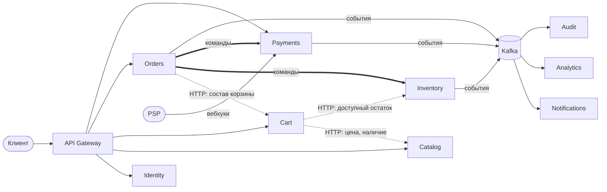
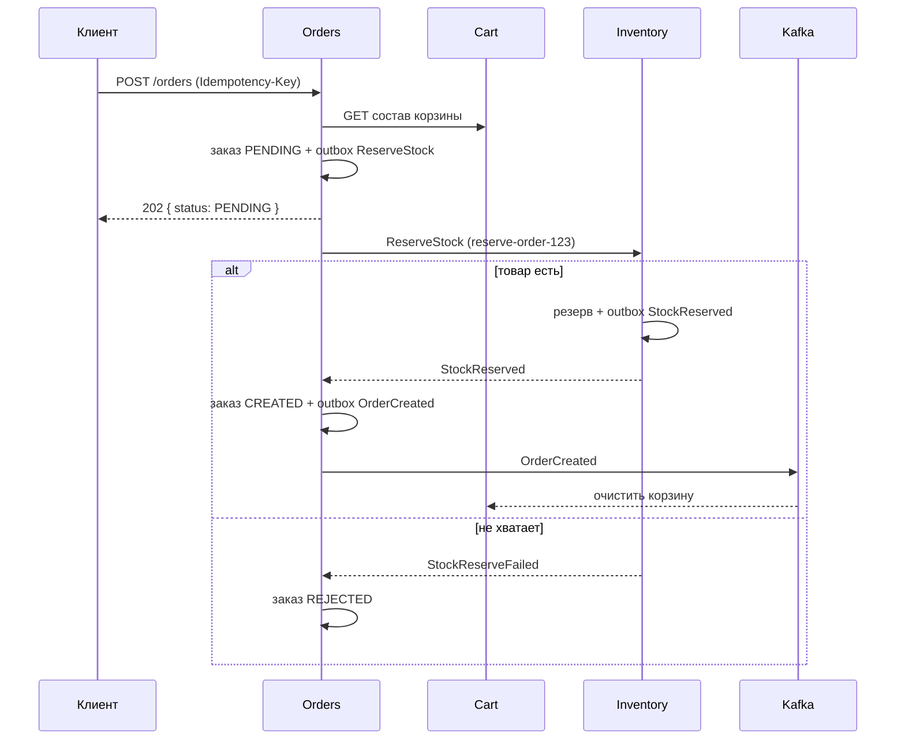

# 08. Разбиение на микросервисы: проектное решение

> Статус: черновик v0.1 · Автор: Дарья Корепанова · Основа: [01-vision.md](01-vision.md), [02-requirements.md](02-requirements.md), [03-data-model.md](03-data-model.md), [04-api.md](04-api.md)

## 1. О документе

ShopCore сейчас — **модульный монолит**: один API, одна база PostgreSQL, вокруг воркеры (outbox relay, уведомления, истечение резервов, аналитика, аудит). Документ отвечает на вопрос: **как разрезать систему на микросервисы, если это понадобится, и что при этом изменится.**

Это проектное решение, а не план немедленной работы. Итоговая рекомендация — в разделе 9: пока оставаться модульным монолитом и выделять сервисы по конкретным причинам.

## 2. Когда разбивать стоит, а когда нет

| Признак, что пора | Признак, что рано |
|---|---|
| Несколько команд мешают друг другу в одном коде и релизе | Одна небольшая команда |
| Части системы растут по-разному (каталог в распродажу ×50, админка — нет) | Нагрузка равномерная и небольшая |
| Нужна независимая надёжность: падение аналитики не должно трогать продажи | Простой монолит и так справляется |
| Разные требования к безопасности и аудиту (платежи, PCI DSS) | Предметная область ещё быстро меняется, границы неясны |

**Цена микросервисов:** нет общих транзакций (саги и конечная согласованность), сетевые сбои между сервисами, межсервисная аутентификация, трассировка, мониторинг, больше инфраструктуры и эксплуатации.

## 3. Принцип разбиения

Границы проводятся **по бизнес-возможностям** (ограниченным контекстам), а не по техническим слоям. Проверка для каждого кандидата: есть ли у этой части **свои правила, свои данные и потенциально своя команда**.

Правила, обязательные для всех сервисов:

1. **База на сервис.** Сервис владеет своими таблицами; чужие данные — только через API или события. Никаких `JOIN` и `UPDATE` по чужим таблицам.
2. **Синхронно — только когда ответ нужен сейчас.** Всё остальное — асинхронно.
3. **Каждое изменение состояния и сообщение о нём — одной транзакцией** (transactional outbox в каждом сервисе, который публикует).
4. **Каждый потребитель идемпотентен** (доставка at-least-once).

## 4. Сервисы

| Сервис | Ответственность | Данные (из текущей схемы) | Публикует | Слушает |
|---|---|---|---|---|
| **Identity** | Регистрация, вход, токены, роли | `users` | `UserRegistered` | — |
| **Catalog** | Товары, категории, цены, активность | `products`, `categories` | `ProductPriceChanged`, `ProductDeactivated` | — |
| **Inventory** | Остатки, резервы, списания, журнал склада | `stock`, `stock_log` | `StockReserved`, `StockReserveFailed`, `StockReleased` | команды `ReserveStock`, `ReleaseStock`, `CommitStock` |
| **Cart** | Корзина покупателя | `carts`, `cart_items` | — | `OrderCreated` (очистить корзину) |
| **Orders** | Заказы, статусная модель, история, истечение; **оркестратор саг** | `orders`, `order_items`, `order_status_history`, `idempotency_keys`, состояние саг | `OrderCreated`, `OrderPaid`, `OrderExpired`, `OrderCancelled`, `OrderRefunded` | `PaymentSucceeded`, `PaymentFailed`, `RefundSucceeded`, ответы Inventory |
| **Payments** | Интеграция с PSP, вебхуки, возвраты, инциденты, сверка | `payments`, `refunds`, `incidents` | `PaymentSucceeded`, `PaymentFailed`, `RefundSucceeded`, `RefundFailed` | команда `RequestRefund` |
| **Notifications** | Письма покупателям | `notifications` | — | события заказов и платежей |
| **Analytics** | Витрина продаж, воронка | схема `analytics` | — | все события |
| **Audit** | Неизменяемый журнал событий | схема `audit` | — | все события |

Решения, требующие обоснования:

- **Inventory отделён от Catalog.** Каталог читается очень часто и меняется редко; остатки меняются постоянно и требуют блокировок строк. Разная нагрузка и разные правила.
- **Orders — оркестратор.** Логика оформления и оплаты собрана в одном месте и читается как один процесс; хореография размазала бы её по сервисам.
- **Analytics и Audit выделяются первыми и почти бесплатно:** они уже работают только на событиях Kafka и ничего не пишут в рабочие таблицы.
- **Дублирование данных — норма.** Orders хранит название и цену товара в `order_items` (уже так по BR-02), Notifications получает всё для письма в самой команде.

## 5. Взаимодействие

| Тип связи | Чем | Где |
|---|---|---|
| Синхронный запрос, нужен ответ сейчас | HTTP (внешний API), HTTP/gRPC (внутренний) | Cart → Catalog, Cart → Inventory, Orders → Cart |
| Команда одному исполнителю, с повторами и задержками | RabbitMQ | Orders → Inventory (`ReserveStock`…), Orders → Payments (`RequestRefund`), отложенное истечение |
| Событие для многих, с историей | Kafka, ключ партиции = `order_id` | Все изменения заказов, платежей, склада |

## 6. Саги

Общей транзакции между сервисами нет. Процесс разбивается на шаги — локальные транзакции в одном сервисе; при сбое выполняются **компенсирующие действия** для уже выполненных шагов. Состояние саги хранит Orders. Все шаги и компенсации идемпотентны.

### 6.1. Оформление заказа

| Шаг | Сервис | Действие | Компенсация |
|---|---|---|---|
| 1 | Orders | Получить состав корзины, создать заказ `PENDING` с ценами на момент заказа | заказ → `REJECTED` |
| 2 | Inventory | `ReserveStock` (ключ `reserve-order-{id}`) | `ReleaseStock` |
| 3 | Orders | По `StockReserved`: заказ → `CREATED`, `expires_at` = +15 мин, `OrderCreated` | — |
| 4 | Cart | По `OrderCreated`: очистить корзину | — (возврат товаров в корзину — открытый вопрос бизнесу) |

Изменение для клиента: `POST /orders` отвечает **202** с заказом в статусе `PENDING`; итог клиент узнаёт опросом `GET /orders/{id}` или push-уведомлением. В монолите ответ был сразу финальным (201 `created` или 409 `OUT_OF_STOCK`).

### 6.2. Оплата

| Шаг | Сервис | Действие | Компенсация / ветка сбоя |
|---|---|---|---|
| 1 | Payments | Создать платёж у PSP (ключ `order-{id}:{клиентский ключ}`), вернуть ссылку | — |
| 2 | Payments | Вебхук `payment.succeeded` → `PaymentSucceeded` | — (**необратимая точка**: деньги списаны) |
| 3 | Orders | Заказ `CREATED` → `PAID`, команда `CommitStock` | если заказ уже `EXPIRED` — см. ниже |
| 4 | Inventory | Списать товар из резерва | — |
| 5 | Notifications | Чек покупателю | — |

**Поздняя оплата (BR-10).** Заказ уже `EXPIRED`, резерв снят:

1. Orders шлёт `ReserveStock` повторно.
2. `StockReserved` → заказ `EXPIRED → PAID`, `CommitStock`, инцидент `late_payment_restored`.
3. `StockReserveFailed` → компенсация платежа: команда `RequestRefund` в Payments, инцидент `late_payment_refunded`, заказ остаётся `EXPIRED`.

### 6.3. Возврат (асинхронно, через outbox)

1. Orders (админ запросил возврат): в одной транзакции — запись намерения и команда `RequestRefund` в outbox; ответ админу **202**.
2. Payments: вызывает PSP с **детерминированным** ключом `refund-{refund_id}` и передаёт свой `refund_id` в metadata; повторы с паузой; после N неудач — инцидент.
3. Вебхук `refund.succeeded` → `RefundSucceeded` → Orders: заказ `REFUNDED`, команда в Inventory вернуть товар на склад.

Это закрывает найденные в монолите проблемы с возвратом: внешний вызов под блокировкой, откат после успешного возврата у PSP, случайный ключ идемпотентности.

## 7. Сквозные механизмы

| Механизм | Решение |
|---|---|
| Единая точка входа | **API Gateway**: маршрутизация, проверка JWT, лимиты запросов. Клиент видит один адрес |
| Подпись JWT | **RS256/ES256**: Identity подписывает закрытым ключом, сервисы проверяют открытым (JWKS). Общий секрет HS256 (как сейчас) позволил бы любому сервису выпускать токены |
| Межсервисная аутентификация | Учётная запись у каждого сервиса (OAuth2 client credentials или mTLS) + права на внутренние эндпоинты |
| Идемпотентность | Ключ генерирует вызывающий сервис, ключ **детерминированный** из бизнес-идентификатора (`reserve-order-123`). Получатель хранит обработанные ключи |
| Надёжная отправка | Transactional outbox и relay в каждом публикующем сервисе |
| Надёжный приём | Идемпотентные потребители, DLQ / parking, разбор инцидентов |
| Вызовы между сервисами | Таймауты, повторы только идемпотентных операций, circuit breaker |
| Трассировка | `X-Request-ID` передаётся во все вызовы и сообщения; распределённая трассировка (OpenTelemetry) |
| Контракты | Версионированные API и схемы событий (поле `version`, реестр схем); обратная совместимость при изменениях |
| Доступ к Kafka | ACL: писать в топик — только сервис-владелец, читать — только подписчики |
| Сверка | Payments ежедневно сверяет платежи с выпиской PSP; Orders — «зависшие» саги (как sweeper сейчас) |

## 8. Путь миграции (Strangler Fig)

Не переписывать всё сразу, а «выращивать» сервисы рядом с монолитом:

| Этап | Что выделяем | Почему в этом порядке |
|---|---|---|
| 1 | Analytics, Audit | Уже работают только на событиях Kafka, рабочие таблицы не трогают — почти бесплатно |
| 2 | Notifications | Уже асинхронный, получает всё нужное в команде |
| 3 | Payments | Изоляция требований безопасности и интеграции с PSP; заодно — возвраты через outbox |
| 4 | Inventory | Отдельное масштабирование склада в распродажи; появляется первая сага |
| 5 | Catalog, Cart, Identity | Только если появится причина: отдельные команды или нагрузка |

## 9. Решение (ADR)

**Контекст.** Одна команда, умеренная нагрузка, предметная область ещё уточняется (открытые вопросы в 01–02).

**Решение.** Оставить ShopCore **модульным монолитом**. Соблюдать границы модулей в коде уже сейчас: модуль не меняет чужие таблицы напрямую, а вызывает функции сервиса-владельца. Выделять сервисы по пути из раздела 8, когда появится конкретная причина из раздела 2.

**Последствия.** Сохраняются общие транзакции и простота отладки. Будущее выделение сервисов дешевле, потому что outbox, идемпотентность и события уже есть.

## 10. Перенос на iGaming

| Сервис iGaming | Аналог в ShopCore | Особенности |
|---|---|---|
| Player / KYC | Identity | Верификация, самоисключение, лимиты ответственной игры |
| **Wallet** (баланс, журнал операций) | Inventory | Самый критичный сервис: блокировка баланса, резерв ставки, ledger без удалений |
| Payments | Payments | Депозиты и выводы, несколько провайдеров, сверка |
| Sportsbook / Casino | Orders | Приём и расчёт ставок, статусная модель ставки |
| Bonus | — | Начисление бонусов, вейджер |
| Risk / Antifraud | Analytics (как читатель событий) | Правила и скоринг в реальном времени |
| Reporting | Analytics + Audit | Отчёты регулятору |

**Сага приёма ставки:** Wallet резервирует сумму (ключ `bet-{id}`) → Sportsbook принимает ставку → если ставка отклонена (сменился коэффициент), Wallet снимает резерв; если ответа нет за N секунд — Wallet запрашивает статус ставки или снимает резерв по таймауту, расхождения ловит сверка.

## 11. Открытые вопросы

- [ ] Возвращать ли товары в корзину, если заказ отклонён или истёк?
- [ ] Допустимо ли покупателю видеть статус `PENDING` при оформлении, или нужен синхронный ответ с ограничением по времени?
- [ ] Один брокер (только Kafka) или два (Kafka + RabbitMQ)? Два — удобнее для отложенных команд и повторов, один — проще эксплуатация.

## 12. История изменений

| Версия | Дата | Что изменилось |
|---|---|---|
| v0.1 | 2026-10-08 | Первая версия |
